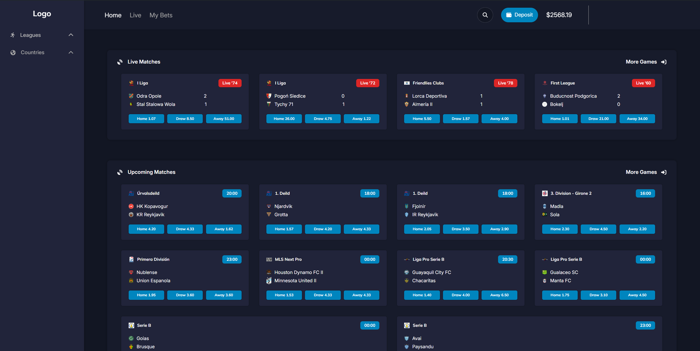

# React + Vite

This template provides a minimal setup to get React working in Vite with HMR and some ESLint rules.

Currently, two official plugins are available:

- [@vitejs/plugin-react](https://github.com/vitejs/vite-plugin-react/blob/main/packages/plugin-react/README.md) uses [Babel](https://babeljs.io/) for Fast Refresh
- [@vitejs/plugin-react-swc](https://github.com/vitejs/vite-plugin-react-swc) uses [SWC](https://swc.rs/) for Fast Refresh

# Bet App

The project is not finished yet, I will come back to it in the future.
This app allow user to see football (soccer) odds, results in the realtime.
I haven't added the functionality to bet on matches yet.
For now, it's just the home page available.

# Technologies

React/Vite
React Router
Redux/Redux Toolkit
Tanstack Query
TailwindCSS

# Installation

# Usage

Put your API KEY into apiKey.env.example.
You can get it for free on https://rapidapi.com/api-sports/api/api-football
